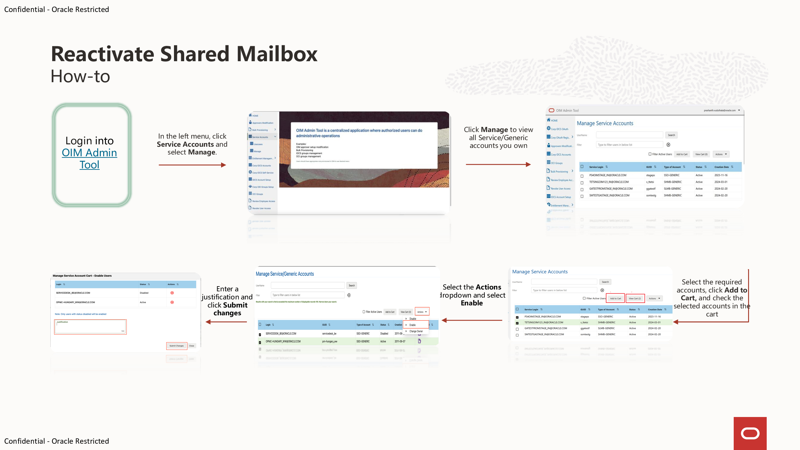
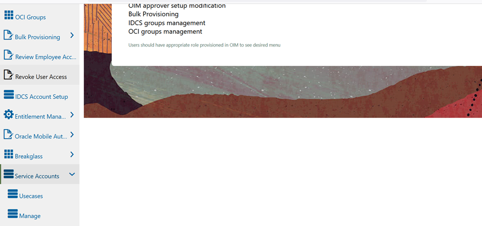
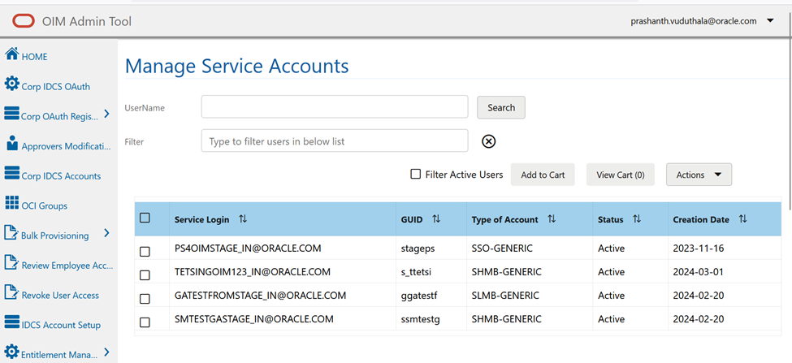
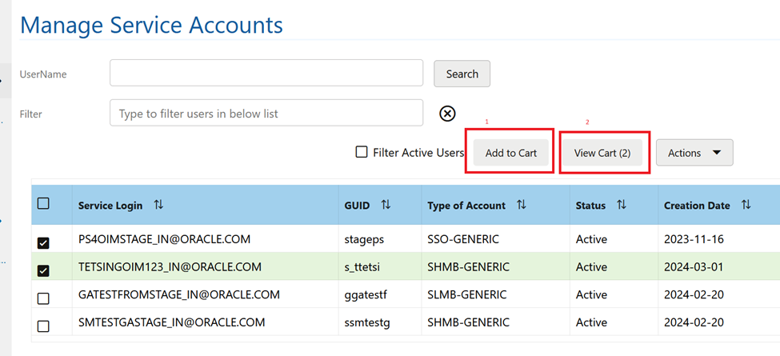
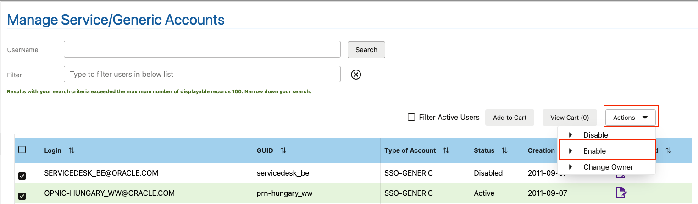
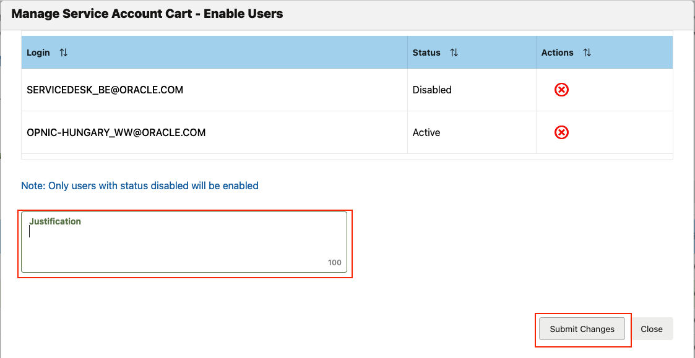
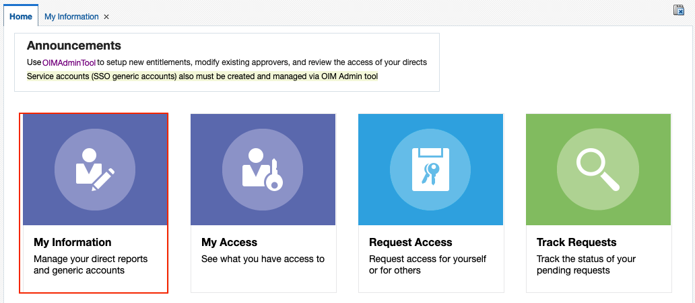
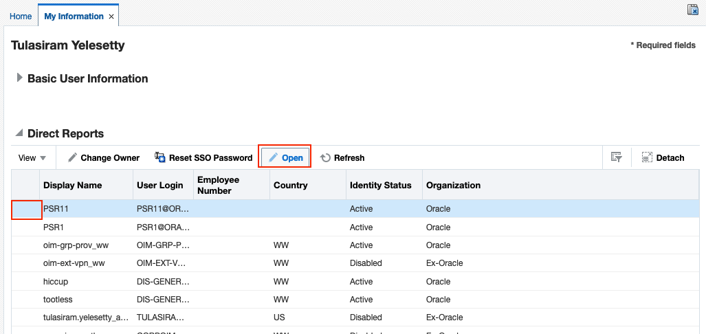
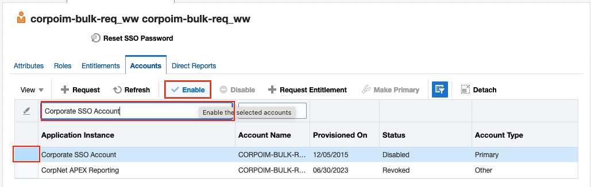
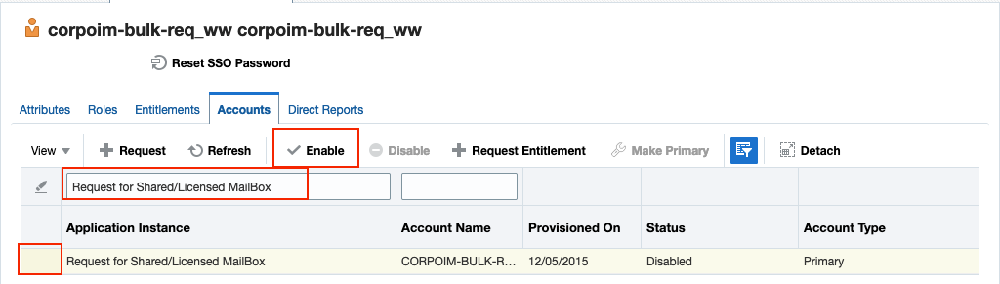

# How to reactivate a shared mailbox

## Introduction

This sprint will help to reactivate a shared mailbox.

### Duration: 15 min

### Objectives

* Reactivate shared mailboxes that is used by Stakeholders and Counci Teams.

### What Do You Need?

Check the following schema to see how to reactivate a shared mailbox.

## Reactivate Shared Mailbox

1. Login into [OIM Admin Tool](https://oim.oraclecorp.com/oimadmintool/)

2. In the left menu, click **Service Accounts** and select **Manage**.

3. Click **Manage** to view all **Service/Generic accounts** you own

  

4. Select the required accounts, click **Add to Cart**, and check the selected accounts in the cart

  

5. Select the **Actions** dropdown and select **Enable**

  

6. Enter a **Justification** and click **Submit Changes**

  

7. Log into [OIM](https://oim.oraclecorp.com).  Select the **My Information** tile

  

8. Scroll to **Direct Reports**, click your **Generic Account**, and select **Open**.

  

9. In the **Accounts** tab, click **Corporate SSO Account** and select **Enable**.

  

10. If you have a Shared Mailbox, click **Request for Shared/Licensed Mailbox** and select **Enable**.

  

## Acknowledgements

* **Author:**
   * Ana Coman, Technical Program Manager, Oracle Database Product Management, October 2024

* **Last Updated By/Date:**
    * Ana Coman, Technical Program Manager, Oracle Database Product Management, October 2024
